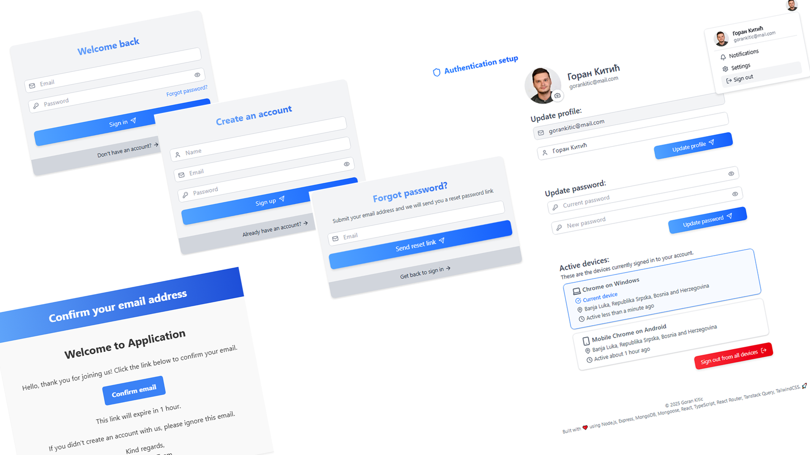

# MERN Authentication & Security Kit

A structured authentication system built while learning **React, Node.js, Express, MongoDB, Mongoose, Tailwind**, and applying modern security best practices.

This repository is a **personal starter kit** and serves as a reference for building authentication systems in my future MERN stack projects.

It includes many real-world authentication patterns used in modern web applications:

-   JWT access tokens
-   Opaque refresh tokens
-   Multi-device sessions
-   Refresh token rotation
-   Device/session revocation
-   HTTP-only cookies flow
-   Email verification
-   Forgot & reset password
-   Password update
-   User profile update & avatar upload
-   Validation, sanitization, rate limiting...

©️ 2025 Goran Kitic

## 🛠️ Quick Start Instructions

### 📌 Requirements

-   Node.js 24+
-   MongoDB Atlas
-   NPM or Yarn

### 🚀 Clone the Repository

### 📦 Install Server Dependencies

    cd backend
    npm install

### ⚙️ Configure Server Environment

Create a .env file:

    NODE_ENV=production
    PORT=3000
    CLIENT_ORIGIN=http://localhost:5173
    SERVER_ORIGIN=http://localhost:3000
    MONGO_URI=your-mongodb-uri
    JWT_ACCESS_SECRET=your-secret
    JWT_ACCESS_TOKEN_TTL_MS=900000 || your-expiresIn-time
    TOKEN_BYTES=64
    REFRESH_TOKEN_TTL_MS=604800000 || your-expiresIn-time
    RESEND_API_KEY=your-resend-api-key
    UPLOADCARE_PUBLIC_KEY=your-uploadcare-secret
    UPLOADCARE_SECRET_KEY=your-uploadcare-secret

### 📦 Install Client Dependencies

    cd frontend
    npm install

### ⚙️ Configure Client Environment

Create a .env file:

    VITE_API_URL=http://localhost:3000

### ▶️ Run the Server

Development

    npm run dev

### ▶️ Run the Client

    npm run dev

# MERN Authentication & Security Kit Overview

### 🔑 Access & Refresh Tokens

Access Token:

-   Used for authorization
-   Lifetime: 10 minutes
-   Sent with every request
-   Stored in an HTTP-only cookie
-   If stolen → attacker has very limited time

Refresh Token:

-   Opaque random string, not a JWT
-   Lifetime: 7 days
-   Sent to client in HTTP-only cookie
-   Stored hashed in database
-   Used only for rotation
-   Must be rotated every time it's used

### 🔄 Refresh Token Rotation

Refresh token rotation means:

-   A refresh token is single-use
-   Every time it is used, it is immediately replaced

This blocks:

-   replay attacks
-   stolen refresh token reuse
-   session cloning

Rotation flow:

-   Client sends refresh token
-   Server finds session by hashed token
-   Old session is revoked
-   New refresh token + new session is created
-   New access token is created
-   New cookies returned

If attacker tries to use old refresh token later:

-   Server sees revoked session
-   Returns 401

### 🍪 Cookies Configuration

-   Both access & refresh tokens are stored in HTTP-only cookies

Access Token Cookie:

-   httpOnly: true
-   sameSite: none
-   secure: true (in production)
-   maxAge: 15 minutes

Refresh Token Cookie:

-   httpOnly: true
-   sameSite: none
-   secure: true
-   maxAge: undefined → session cookie (deleted when browser closes)

Why no maxAge for refresh token?

-   Server controls expiration via DB expiresAt
-   More secure (browser does not persist it to disk)
-   If stolen, it disappears when the browser closes

### 📱 Multi-Device Sessions

Every login creates a session document:

-   Each device = one session
-   Each session has its own refresh token
-   You can revoke only one device or all devices

Why?

-   Allows login from multiple devices
-   Allows logout from only current device
-   Allows global logout on password change
-   Allows suspicious activity detection
-   Sessions are centrally stored in MongoDB

## 🔐 Authentication Workflow Overview

Below are all flows included in architecture

### 📝 1. Signup Flow

-   Validate input data
-   Generate verification token
-   Store only hashed verification token
-   Store only hashed password
-   Create user document
-   Send email with plain token
-   User is not signed in yet

Rules:

-   Do not store plain tokens or passwords
-   Use TTL index to delete unverified users automatically

### ✉️ 2. Email Verification Flow

-   User receives a time‑limited link with verification token
-   User clicks verification link
-   Server hashes token
-   Find user where token matches & not expired
-   Update verification fields
-   User may now sign in.

### 🔓 3. Signin Flow

-   Validate input data
-   Validate credentials
-   Find user
-   Reject if user not found || password incorrect || email not verified
-   Create: access token (JWT), refresh token (opaque), session document
-   Send both tokens in HTTP-only cookies

### 🔃 4. Refresh Flow

-   Extract refresh token cookie
-   Hash it
-   Find corresponding session
-   Reject if: session not found || revoked || expired
-   Create new session (rotation)
-   Revoke old session
-   Generate new access token
-   Return cookies

Old refresh token becomes instantly useless.

### 🛡️ 5. Protect Middleware (Protected Routes)

-   Read access token from cookie
-   Verify access JWT
-   Extract sessionId
-   Check session exists & not revoked
-   Fetch user
-   Reject if: user deleted || password changed after token issued
-   Attach req.user and req.session

### 🚪 6. Sign Out (One Device)

-   Read refresh token
-   Hash it
-   Find session
-   Revoke session
-   Clear cookies

### 🚪🚪 7. Sign Out All Devices

-   Using userId, revoke all active sessions
-   Clear cookies
-   Used on: password change || reset password

### 🔧 8. Forgot Password

-   User enters email
-   Find user
-   Generate reset token
-   Store hashed token
-   Email the plain token
-   If email sending fails → cleanup fields

### 🔧 9. Reset Password

-   Validate new password
-   Read token from query
-   Hash token
-   Find user
-   Update password
-   Revoke all sessions
-   Clear cookies
-   User must sign in again

### 🔒 10. Update Password

-   User is authenticated
-   Provide current + new password
-   Verify current password
-   Update password
-   Revoke all sessions
-   Clear cookies
-   Same as reset password → global logout required
